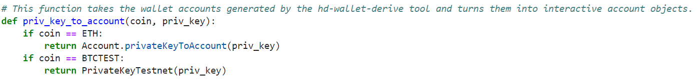
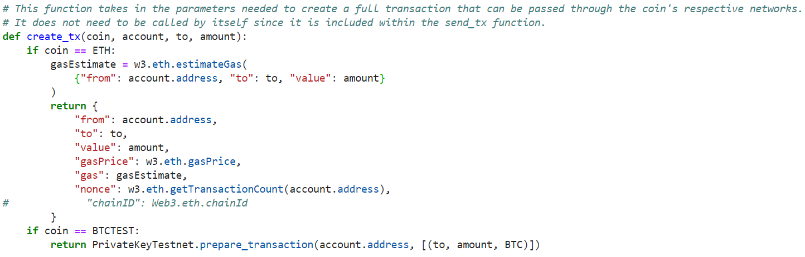
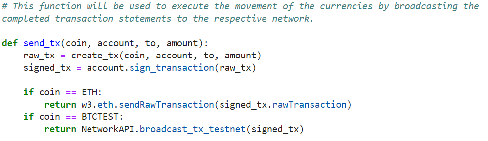
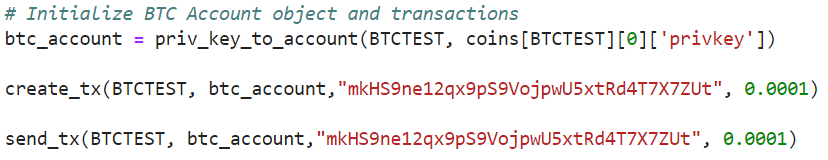
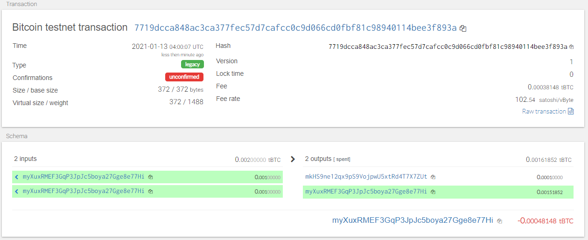
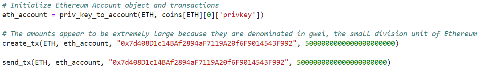
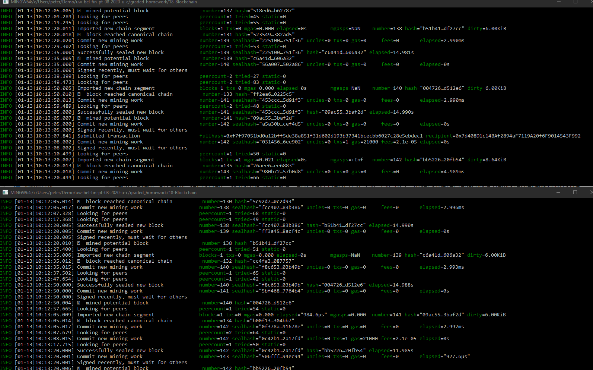

# Pythonic Blockchain Wallet

### Manage and Move Your Cryptocurrencies, Programatically

Introduction
 
This project was conceived to provide a functional cryptocurrency wallet built from scratch. The wallet was first built specifically for Bitcoin and Ethereum, but still retains expansion functionality and later versions could include many more alt-coins. The application has been tested on a public BTC and private Ethereum testnets. We used the HD-Wallet-Derive termial tool, Web3, and bit as the primary libraries for key control and transaction execution. 

These tools require rather specific installation processes, and if not already install on your machine/enviroment, you will find a hd-wallet-derive guide [here](Install_readmes/HD_Wallet_Derive_Install_Guide.md) and a guide for both web3 and bit [here](Install_readmes/Blockchain_TX_Install_Guide.md).
 

##### Usage Instructions and Explanation
1) First, open a terminal window and navigate into the wallet directory.

2) You will then need to derive a 12 word mnemonic using the 'hd-wallet-derive' tool or [this tool](https://iancoleman.io/bip39/).

3) With this new mnemonic, you'll need to set it as an .env so that the derived keys will be able to be accessed. 

4) Once the mnemonic has been set, and the addresses can be accessed with private keys, you are free to begin sending transactions. This is accomplished through the use of the following functions:

* We first must pass this function to create the necessary 'account' objcet upon which all subsequent functions, bit, and web3 will rely on.
    * For an ETH transaction: priv_key_to_account(ETH, coins[ETH][0]['privkey']).
    * for an BTCTEST transaction: priv_key_to_account(BTCTEST, coins[BTCTEST][0]['privkey']).
* Coin refers to the cryptocurrency account desired.
* 'priv_key' is the private key required to unclock all functionality for the desired account.

 

* This transaction DOES NOT NEED to be passed independently, as we will see later on, it exists within the send transaction function as well.
    * The transaction takes all the pieces needed to create transactions from the account objects created previously and prepares the completed transaction for broadcast.
* Coin once again refers to the cryptocurrency.
* Account is the account object from priv_key_to_account.
* To is the recipient address.
* Amount is the total coins to be sent.

 

* This function is the primary execution function. By passing the requested arguments, this function will both build and then execute the requested transaction. This can be executed in a terminnal or within the program file itself.
    * Coin once again refers to the cryptocurrency.
    * Account is the account object from priv_key_to_account.
    * To is the recipient address.
    * Amount is the total coins to be sent.
* For an Ethereum transaction, the transaction is built with 'creat_tx' and then using the Web3 library, broadcasted to the ethereum network using ".eth.sendRawTransaction(signed_tx.rawTransaction)".
* For a BTCTEST network transaction, using the bit library, the built transaction is sent using  "NetworkAPI.broadcast_tx_testnet(signed_tx)".

### Sample Transactions
#### BTC-Test

1) First step is to execute the functions with the necessary arguments in order showed in the blow example. Functions for a valid BTC-Test network transaction:

NOTE: Passing the create_tx() is not required.

2) After passing the above functions, using any BTC-Test network scanner, you can verify the transaction by searching either your address or the recipient's address.

#### ETH Proof of Authority Network Transaction.

1) First step is to execute the functions with the necessary arguments in order showed in the blow example. Functions for a valid ETH PoA network transaction:

NOTE: Passing the create_tx() is not required.

2) After passing the above functions, using the mycrypto transaction scanner, you can verify the transaction by searching either your address, the recipient's address, or the transaction's fullhash.

